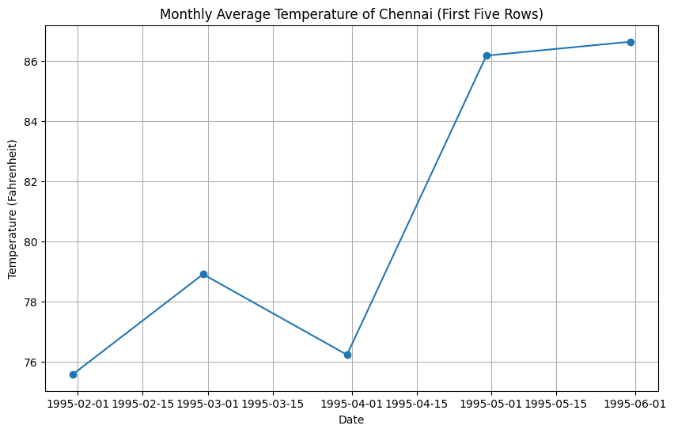
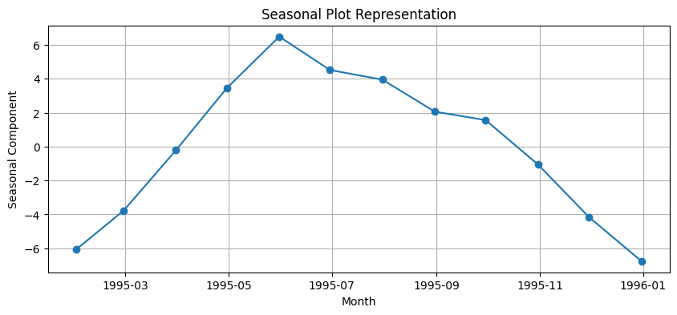
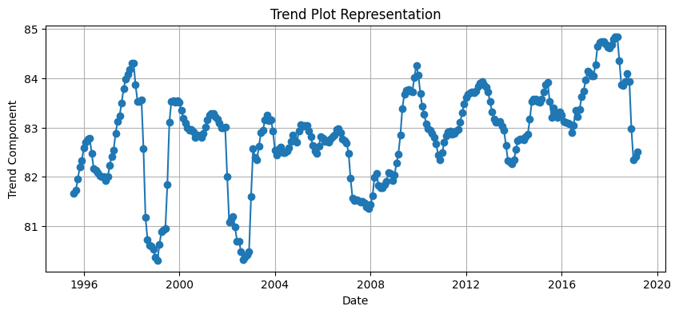
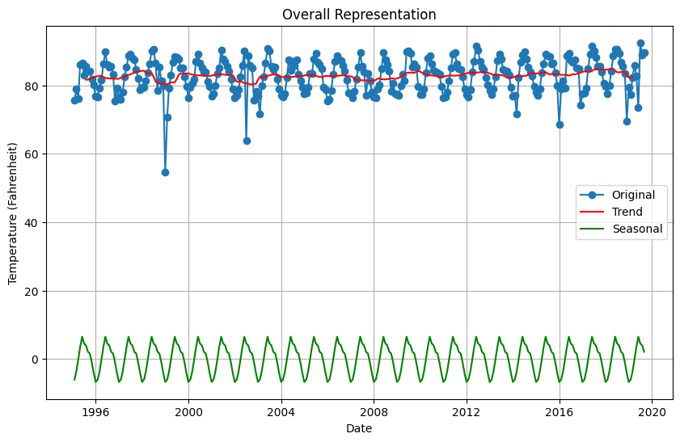

# Ex.No: 05  IMPLEMENTATION OF TIME SERIES ANALYSIS AND DECOMPOSITION
### Date: 


### AIM:
To Illustrates how to perform time series analysis and decomposition on the monthly average temperature of a city/country and for airline passengers.

### ALGORITHM:
1. Import the required packages like pandas and numpy
2. Read the data using the pandas
3. Perform the decomposition process for the required data.
4. Plot the data according to need, either seasonal_decomposition or trend plot.
5. Display the overall results.

### PROGRAM:
```py
# Kavinraja D
# 212222240047
import pandas as pd
import matplotlib.pyplot as plt
from statsmodels.tsa.seasonal import seasonal_decompose

# Load the data
data = pd.read_csv("chennai.csv")

# Combine year, month, and day into a single date column
data['Date'] = pd.to_datetime(data[['YEAR', 'MONTH', 'DAY']])

# Set the 'Date' column as the index
data.set_index('Date', inplace=True)

# Drop unnecessary columns
data.drop(['YEAR', 'MONTH', 'DAY'], axis=1, inplace=True)

# Resample to monthly average temperature
monthly_avg_temp = data.resample('M').mean()

# Plotting the first five rows of data
plt.figure(figsize=(10, 6))
plt.plot(monthly_avg_temp[:5], marker='o')
plt.title('Monthly Average Temperature of Chennai (First Five Rows)')
plt.xlabel('Date')
plt.ylabel('Temperature (Fahrenheit)')
plt.grid(True)
plt.show()

# Time series decomposition
result = seasonal_decompose(monthly_avg_temp['TEMPERATURE'], model='additive')

# Seasonal plot representation
plt.figure(figsize=(10, 4))
plt.plot(result.seasonal[:12], marker='o')
plt.title('Seasonal Plot Representation')
plt.xlabel('Month')
plt.ylabel('Seasonal Component')
plt.grid(True)
plt.show()

# Trend plot representation
plt.figure(figsize=(10, 4))
plt.plot(result.trend, marker='o')
plt.title('Trend Plot Representation')
plt.xlabel('Date')
plt.ylabel('Trend Component')
plt.grid(True)
plt.show()

# Overall representation (original data)
plt.figure(figsize=(10, 6))
plt.plot(monthly_avg_temp, marker='o', label='Original')
plt.plot(result.trend, color='red', label='Trend')
plt.plot(result.seasonal, color='green', label='Seasonal')
plt.title('Overall Representation')
plt.xlabel('Date')
plt.ylabel('Temperature (Fahrenheit)')
plt.legend()
plt.grid(True)
plt.show()
```


### OUTPUT:
#### FIRST FIVE ROWS:



#### SEASONAL PLOT REPRESENTATION :



#### TREND PLOT REPRESENTATION :


#### OVERAL REPRESENTATION:



### RESULT:
Thus we have created the python code for the time series analysis and decomposition.
